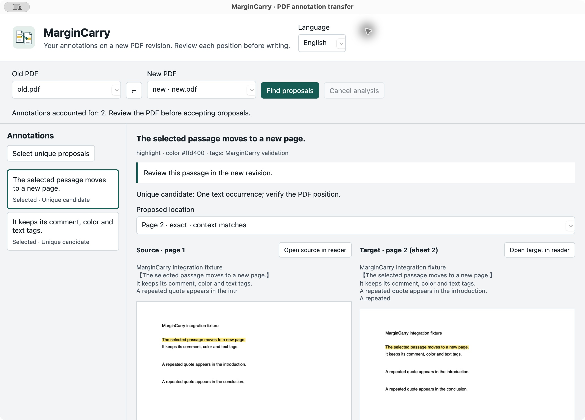
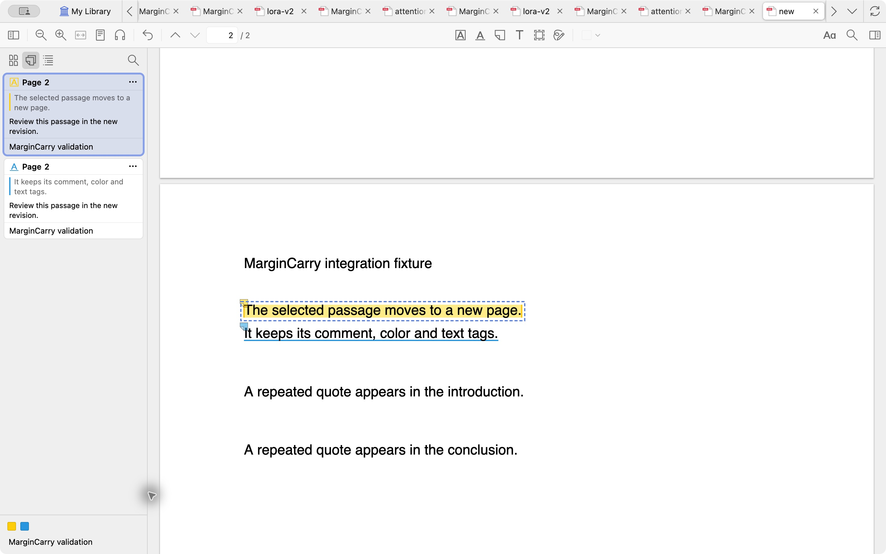

<p align="center"></p>

# MarginCarry

[](LICENSE)
[](docs/engineering-report.md)
[](https://github.com/0then0/margincarry/actions/workflows/check.yml)

An open Zotero Desktop plugin for carrying highlights and underlines to a new PDF revision. Compare the original and proposed locations, select proposals, and confirm the write. The result is an ordinary Zotero annotation with its comment, color, and text tags.

PDF annotation transfer already exists in other tools. MarginCarry provides a small local workflow directly between two Zotero attachments. [Related work](docs/related-work.md) explains the implementation choices.

## Install

You need **Zotero 10.0.5 or a later 10.0.x release**, two locally available PDF attachments of the same bibliographic item in your personal library, and a usable text layer. Historical native checks used 10.0.5; the published v0.1.0 XPI was also exercised on **10.0.6**, macOS 15.7.9, Apple Silicon. The October 8 follow-up also checked ordinary mouse-created annotations and live highlight/underline overlays for all four geometry outliers. Strict geometry discrepancies remain recorded; see the [published-artifact validation](docs/native-v010-validation.md) and [follow-up](docs/native-v010-followup.md). Windows, Linux, and other host versions have not been verified; manifest ranges alone are not testing evidence.

1. Download `margincarry-0.1.1.xpi` and its SHA-256 file from [release v0.1.1](https://github.com/0then0/margincarry/releases/tag/v0.1.1). To build from source instead, run `npm ci && npm run build` with Node.js 24 and Python 3; output is placed in `dist/`.
2. In Zotero, open **Tools → Plugins**, then the gear menu → **Install Plugin From File…**, and select the XPI.
3. **MarginCarry: transfer PDF annotations…** appears in **Tools**. Its language follows Zotero; unsupported locales fall back to English.

Node.js and Python are only needed to build the plugin. An installed XPI runs inside Zotero. Installing the release package does not require development tools.

## Transfer annotations

1. Add the new PDF revision beside the old attachment under the same item. Select both attachments or their bibliographic item.
2. Open MarginCarry from **Tools**. Check **Old PDF** and **New PDF**; `⇄` swaps the direction. The **Language** buttons provide English and Russian. [Language control](docs/images/language.png).
3. Click **Find proposals**. Every source annotation receives an outcome. You can cancel before applying; cancelling while the initial previews load also discards the plan.
4. Compare the actual PDF previews, quoted text, context, and pages. Reader buttons open the actual locations. Choose a candidate explicitly when a quote has several plausible occurrences.
5. Click **Accept proposal** or **Skip**. **Select unique proposals** adds unique proposals to the set for your review.
6. Inspect **Selected to write**, click **Apply selected**, and confirm the number of copies and target file. Analysis and selection never write annotations automatically.
7. Click **Open created annotation**. The target PDF shows native highlights or underlines, comments, colors, and tags.





Screenshots use Zotero 10.0.5 in an isolated profile and documents created by this project. They show the working plugin and native reader, not mockups.

**Undo last transfer** moves only that operation's copies to Zotero Trash. If any copy has been edited, moved, or deleted, the entire undo stops with a conflict. Source annotations and pre-existing target annotations remain intact. The journal blocks reapplying the same plan and copying an already transferred source annotation to the same PDF revision.

Closing the review window does not cancel an active write. Wait for it to finish before opening MarginCarry again; journal recovery is blocked while a write or undo is active.

Copies receive new annotation keys. Existing Zotero note links continue to open the original annotations; MarginCarry does not rewrite those links.

## Read the outcomes

- **Unique candidate:** one occurrence, or one occurrence matching the complete available context. Other candidates remain available when context resolves ambiguity. You must still review the PDF position.
- **Multiple candidates:** human choice is required. In the corpus, the short quote `LoRA` occurs 120 times in the target revision. Acceptance is disabled until you choose a numbered candidate; changing it revokes the previous acceptance. [Example: selecting the second occurrence](docs/images/ambiguous.png).
- **Not found:** the quote is absent after the permitted normalization. In Attention, a BLEU result changes from `41.0` to `41.2`; the original annotation is not moved onto the changed number. PDFs without a usable text layer show a specific reason and cannot be accepted. [Example: no text layer](docs/images/not-found.png).
- **Unsupported:** another annotation type, a multi-page or discontinuous selection, or source text that does not agree with its geometry.
- **Processing error:** extraction or geometry cannot produce a reliable proposal. A text match without verified coordinates is not ready to write.

Search preserves case, numbers, punctuation, negation, and diacritics. Only Unicode NFC and whitespace folding are allowed. Restored ranges must match the quote under the same normalization and align with complete PDF glyphs. A partial grapheme cannot silently expand into additional meaningful symbols. There is no fuzzy matching or OCR. The old page number is not identity evidence. The limit is 200 candidates per annotation; a truncated search cannot be declared unique.

## Data and limits

Documents, preview images, text, and annotations are processed locally. There is no MarginCarry account, telemetry, cloud API, backend, or required paid service. Zotero's own network features, including sync and plugin update checks, follow Zotero's settings.

The plugin stores `margincarry/transfers.json` in Zotero's data directory: attachment and copy keys, original quotes and annotation properties, geometry, paths and file hashes, and fingerprints for verification and undo. This journal can contain private comments and local paths. Previews stay in memory; the full PDF text is not saved to a separate index. Deleting the journal removes undo history and duplicate-transfer protection.

v0.1 supports native highlight/underline and continuous selections on one page, between two PDFs of one item in a personal library. Individually rotated, diagonal, isolated, or out-of-crop-box glyphs are excluded. Rotation of the whole page has been checked. Library-wide processing, group libraries, EPUB, HTML, ink, images, sticky notes, custom sync, translation, and AI are outside scope.

The adapter uses internal Zotero reader APIs, so a host update can break integration. Before extraction it reloads the selected PDFs from disk and checks their revision. A file replacement or reader reload after analysis requires new analysis; stale coordinates are not reused. Very large pages may require inspection in the reader instead of a preview.

Validation remains incomplete. The independent LoRA comparison retains four corner discrepancies greater than two PDF points for a short ambiguous quote. All four agree exactly with native reader range geometry; independent text and native print-overlay review support different vertical metrics, without changing the strict scorer failures. Ordinary mouse selections and those four live desktop overlays still need verification. No confirmed defect currently justifies v0.1.1. The [engineering report](docs/engineering-report.md) separates new published-XPI evidence from historical checks.

## Development and checks

Use Node.js 24, npm, and Python 3 with its standard library. The XPI has no runtime dependencies; development tool versions are pinned in the lockfile.

```sh
npm ci
npm run format       # apply Biome formatting
npm run format:check # check formatting without edits
npm run lint         # warnings fail the check
npm run check        # Biome, strict TypeScript, node:test, XPI build
```

Biome checks TypeScript, JavaScript, JSON, and CSS. Python, SVG, XHTML, and YAML are outside its parser coverage. Frozen fixtures and reports in `validation/` are not reformatted. `any` is permitted only at the dynamic Zotero API boundary; limited test and bootstrap exceptions are documented in the [development guide](docs/development.md).

[Development guide](docs/development.md) provides isolated host setup and reproducible corpus checks. [Engineering report](docs/engineering-report.md) separates automated tests, actual native API checks, UI checks, and unverified platforms. GitHub Actions runs independent checks and packaging, not the native Zotero workflow.

Project source and the original SVG icon are Apache-2.0 licensed. See [dependencies and licenses](THIRD_PARTY.md).
